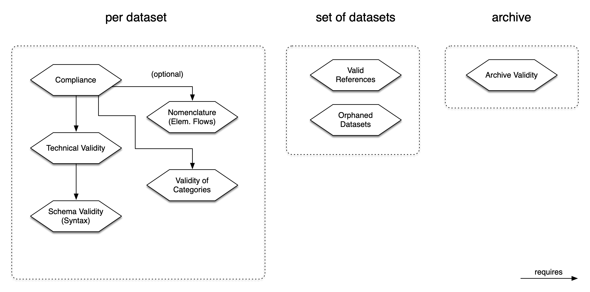

# Validating ILCD Data Using the ILCD Validation Library

## Validation Aspects

In order to be able to flexibly use and combine different types of checks depending on the application, we are defining the term validation aspect, which can be differentiated into technical and semantic aspects. Technical aspects are those that aim at formal validity from a technical point of view, for example, correct syntax (i.e., conformity to the XML schema) or the validity of references. Semantic aspects, on the other hand, concern the meaning of certain content, for example, whether the nomenclature used is compliant with a reference system. Conformity plays a special role as a higher-level aspect, which requires validity in terms of both technical and semantic aspects.

The following validation aspects are supported by this library, with higher-level aspects marked with (H), technical aspects marked with (T) and semantic aspects with (S):

At the data record level:

- Conformity (H): Do data records meet the criteria defined by a conformity system and are they technically valid?
- Schema validity (T): Does a data record comply with the declared XML schema(s)?
- Format validity (T): Does a data record comply with the format specification of the ILCD format and, if applicable, the  extensions?
- Categories (S): Do the categories declared in data records correspond to the specified category system?
- Conformity to a reference system (S): Does a data record refer exclusively to flows (and, if applicable, flow properties and unit groups) that belong to a specified reference system?


On a set of data records:

- Links (T): Can all local and/or remote references be resolved?
- Orphaned data sets (T): Does a set of data sets contain any that are not referenced by any other data set within the set?


At the archive or file system level:

- Archive validity (T): Does an archive comply with the format specification in terms of its folder structure and optional manifest file?
- File name consistency (T): Do the file names of data records in an archive or on a file system match the actual UUIDs of the data records?

Some aspects are interrelated in such a way that validity in one aspect requires validity in another aspect. For example, a successful format validity check requires both a positive result from the schema validity check and valid categories. Other aspects are not interdependent, such as "valid references" and "orphaned records."




For each of the test aspects presented above, separate test routines are available in the form of a validator object. Their names are based on the name of the respective test aspect. Specifically, these are:

- `ArchiveValidator`
- `CategoryValidator`
- `LinkValidator`
- `OrphansValidator`
- `ReferenceFlowValidator`
- `SchemaValidator`
- `ILCDFormatValidator`
- `XSLTStylesheetValidator`

The basic principle here is that a set of objects to be checked and, if necessary, additional parameters are passed to a validator, and the check is then initiated by calling the `validate()` method of the validator object.

The individual `Validator` objects can be cascaded as desired using another construct, `ValidatorChain`, so that the same set of objects to be checked can be passed to multiple validators one after the other and checked by each of them with regard to a specific aspect, requiring only one call to the `validate()` method on the parent `ValidatorChain` and returning a combined set of validation events from all validators.

If a deviation from the expected state is detected by a Validator during the validation, a corresponding validation event is generated. This contains the following information:

- Type: Type of event (error or warning)
- Type of error message: generic or specific
- Validation message: Textual description of the event/deviation
-  Reference: Reference to the object (data record) during the validation of which the event occurred, with UUID, logical name, and file name if applicable.

The total number of validation events is returned after the check is complete for further processing (e.g., display or export).

The validation rules for a set of aspects can be bundled in a validation profile.


## Validation Profiles

Profiles are a means to perform certain validation procedures against a defined
set of rules which may differ from the standard ILCD XML Schema documents,
validation style sheets, reference objects and/or categories.

A profile is a set of XML Schema documents, validation style sheets, categories
documents and/or lists of reference objects, all bundled inside a JAR file. A
manifest file inside the JAR provides all required meta information about the
profile.

Profiles are managed by the `ProfileManager` class. By default, the standard ILCD
profile will be used for all validators without further explicit actions. To
load a different profile, simply call the ProfileManager's `registerProfile()`
method, supplying a URL to the profile JAR to be loaded as an argument. Once
successfully loaded, the profile will subsequently be available using the
ProfileManager's `getProfiles()` method.

By default, the standard ILCD profile will be used for all validators without
further explicit actions or necessity to explicitly call the ProfileManager.

To load a different profile than the default one, use the ProfileManager's
`registerProfile()` method. Once successfully loaded, the profile will then be
available using the getProfiles() method and can be passed to a Validator.

The location of a profile JAR is provided as a URL. The JARs are cached in a
directory which by default is a temporary one. This can be overridden by
passing a location during initialization.

Within an environment like Eclipse, it might be necessary to use some custom
resolution mechanism, which can be implemented in a custom Locator that can
be passed as parameter during initialization.

The loading of default profiles can be controlled using during explicit
initialization using the ProfileManagerBuilder's
`registerDefaultProfiles(boolean registerDefaultProfile, boolean registerSecondaryDefaultProfiles)`
method as shown below, for example to prevent the ProfileManager from loading
any default profiles.

Explicit initialization has to occur before calling the ProfileManager's
`getInstance()` method for the first time.

Example for passing parameters during initialization:

```java
    new ProfileManager.ProfileManagerBuilder()
        .cacheDir(File dir)
        .locator(new EclipseLocator())
        .registerDefaultProfiles(false, false)
        .build();
```

The EclipseLocator class could look like this:

```java
	public class EclipseLocator implements Locator {
		@Override
		public URL resolve(URL url) throws IOException {
			return FileLocator.resolve(url);
		}
	}
```


## Validation Results

Each Validator will emit validation events when it detects an issue in the data to check. A validation event can be a warning or an error.
If only warnings are present, the validation will be considered successful.

A `ValidationEvent` has the following properties:

- **aspect** - A string identifying the validation aspect (e.g., "XML Schema Validity")
- **aspectDescription** - A string providing a description of the validation aspect
- **severity** - A `Severity` enum indicating the severity level of the event (e.g., WARNING, ERROR, SUCCESS)
- **type** - A `Type` enum specifying the type of validation event (defaults to ) `Type.GENERIC`
- **reference** - An object pointing to the dataset being validated `IDatasetReference`
- **messageReference** - An object for additional message context `IDatasetReference`
- **message** - A string containing the primary validation message
- **altMessage** - A string containing an alternative validation message

The `Validator` object (usually a `ValidatorChain`) will also contain a `Statistics` object that provides information about the number of 
validation events that have been emitted in total and per specific dataset type. 


## Example Code

You can find a working [example](../src/example/java/com/okworx/ilcd/validation/example/ValidationExample.java) that demonstrates how to use the library.
