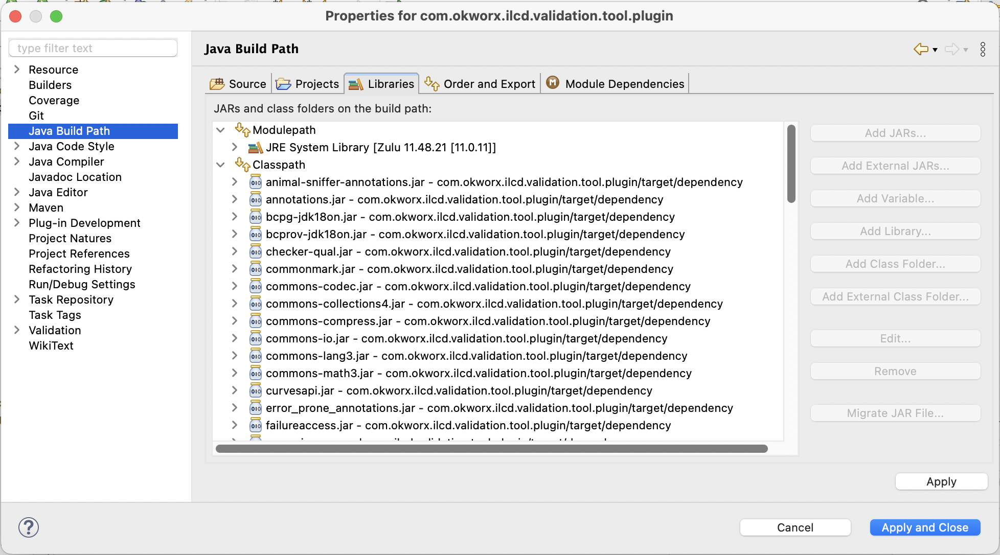
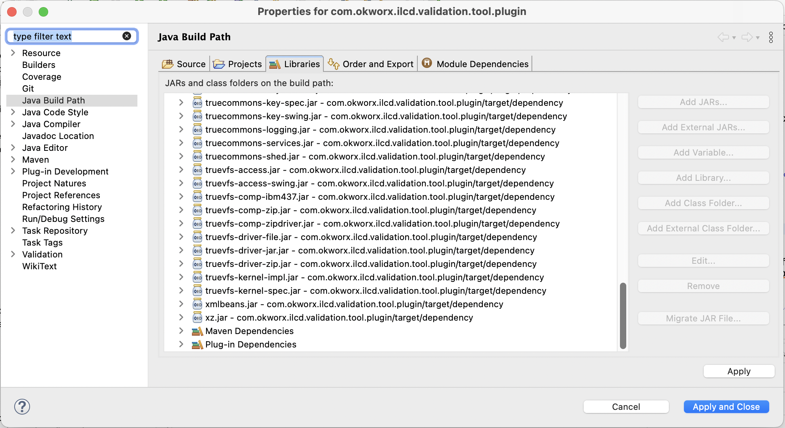

# ILCDValidationTool

## Prerequisites

This project currently requires JDK 11.

(We want to upgrade it to JDK 21 in order to be able to upgrade the platform to the latest Eclipse release.)


## Known issues

currently none


## How to setup Eclipse

Before you import the project make sure that following is valid for your eclipse/environment:

- You have "Eclipse IDE for RCP and RAP Developers" or later. In general it is both safe and a good idea to use the latest and greatest release. Find it here [https://www.eclipse.org/downloads/packages/](https://www.eclipse.org/downloads/packages/)
- There are no eclipse files (e.g. `.classpath, .project, .settings`) in this project
  - If not, run `mvn eclipse:clean`
- You have JDK 11 installed and configured in Eclipse
  - If not, add it to installed JREs and make it the default (or set it later in the plugin project settings)
  - ... and change the `Compiler compliance level` to 11
- You have Maven 3.8 or newer installed and on your path


0. Clone the source code repository to a directory of your choice (e.g. your ~/git directory). It is explicitly NOT recommended to clone it into Eclipse IDE's workspace.

1. To import the projects go to `File -> Import...`, Select `Maven -> Existing Maven Projects`. On the next page select the root directory of this project and import all projects.

*Note:*
In theory, Eclipse should automagically pick up the structure and properties of all nested projects. In case
it does not and the project fails to compile, here are some tips what the `com.okworx.ilcd.validation.tool.plugin` 
project needs to look like.

It should have the `Maven Nature`, `Plugin Development` and `Java` under "Project Natures". The "Java Build Path" should look like this:



	

2. In Eclipse preferences under "Plug-in Development / Target Platform", select the target platform from the project which is located in `releng/target-platform`. This makes sure we're building against a defined set of plugins instead of your local Eclipse installation.

3. To run the project from within eclipse, open the `.product` file in the `releng/com.okworx.ilcd.validation.tool.product` project. Under _Testing_ there is an option _Launch an eclipse application_.

In case there are complaints about missing plugins, open _Run configurations..._, select the _ILCDFormatValidationTool.product_ configuration and go to _Plug-ins_. Click _Add Required Plug-Ins_, _Apply_ and then _Run_.


## How to Build

- Run `mvn clean verify` in root folder
- After maven is finished, the final archives are in `releng/com.okworx.ilcd.validation.tool.product/target/products`

By default, binaries for all platforms will be built. To exempt any platforms from build, you'll need to comment them out the following (make sure you don't commit these changes though):

- `releng/com.okworx.ilcd.validation.tool.configuration/pom.xml` in the `environments` section

DMGs for macOS will only be built when running the build on macOS and require the `create-dmg` tool to be available in the path. Get it from here and install it using `make install`: https://github.com/create-dmg/create-dmg

DMG creation is being skipped by default and can be enabled with `-Ddmg.skip=false`.


## Building releases

After testing, trigger the final build with  

```bash
export CODESIGN_ID=XXXXXXXXX
mvn clean verify -Ddmg.skip=false -Dsign.macos.skip=false -Dsign.gpg.skip=false
```

**Don't forget to tag the source code with the version number after publishing.**

```bash
git tag <NEW_VERSION>; git push --tags
```


## How to update the version number

Run the following commands in the root folder to change the version in every files like `pom.xml, MANIFEST.MF, feature.xml` and `*.product`:

```
mvn -Dtycho.mode=maven org.eclipse.tycho:tycho-versions-plugin:5.0.3:set-version -DnewVersion=<NEW_VERSION>
mvn versions:set -f releng/com.okworx.ilcd.validation.tool.configuration/pom.xml -DnewVersion=<NEW_VERSION>
```
and manually set the parent version of the `pom.xml` in the project root and remove the extra version property 
at the bottom (something that needs to be straightened out).

After Update you can add release notes for new version in `com.okworx.ilcd.validation.tool/resources/release-notes.html`.


### Test p2 update with local/test repo

You can specify your own p2 repository location by appending following settings to `ILCDValidationTool.ini`:

```
-vmargs
-DUpdateHandler.Repo=http://localhost:8080/
```

or

```
-vmargs
-DUpdateHandler.Repo=https://www.okworx.com/software/ILCDValidationTool.staging/
```

To test the update process, you need to either delete the `~/ILCDValidationTool` directory or change the version in `~/ILCDValidationTool/.metadata/.plugins/org.eclipse.core.runtime/.settings/com.okworx.ilcd.validation.tool.plugin.prefs` to an older number (e.g. you want to test the update from 2.0.1 to 2.1.0, you need to set the version to 2.0.1).


### Update of ilcd-validation library

If the ilcd-validation library has been updated, included profiles will be included in the product without any necessary changes.

Note for testing: Updated profiles will only be picked up on existing installations once the application version has been incremented. 


## How to update the bundled JRE Version

We are now using JustJ (https://www.eclipse.org/justj/) which will automagically pick the latest available JRE from the p2 repo. To change to another major version, adjust the p2 repo URL in `configuration/pom.xml` and in the target platform definition (`target-platform.target`).

```		xml
		<repository>
      		<id>justj</id>
      		<url>https://download.eclipse.org/justj/jres/11/updates/release/latest/</url>
      		<layout>p2</layout>
 		</repository>
```


## How to Deploy

** needs testing/update **
After build, run `ant` in the `releng/com.okworx.ilcd.validation.tool.product` folder and enter the password when prompted.


## Project Structure

```
|-- Developer-README.md
|-- pom.xml
|-- bundles
|   |-- com.okworx.ilcd.validation.tool.plugin
|   `-- pom.xml
|-- features
|   |-- com.okworx.ilcd.validation.tool.feature
|   `-- pom.xml
`-- releng
    |-- com.okworx.ilcd.validation.tool.configuration
    |   `-- pom.xml                             <---------- *top-level POM*
    |-- com.okworx.ilcd.validation.tool.product
    |-- target-platform
    |-- pom.xml
    `-- upload.sh
```

- **bundles** (plugin projects)
  - `com.okworx.ilcd.validation.tool.plugin`: contains the eclipse plugin, which holds all UI contributions and source code
- **features** (feature projects)
  - `com.okworx.ilcd.validation.tool.feature`: is the feature project and needed for p2 updates. Besides the `feature.xml` file it also contains files which will be bundled in final archive (like licenses)
- **releng** (release engineering)
  - `com.okworx.ilcd.validation.tool.configuration`: in the `pom.xml` of this project are the p2 repositories for the tycho build defined
  - `com.okworx.ilcd.validation.tool.product`: contains the eclipse product definition of the project
  - `target-platform`: contains the eclipse target definition of the project
